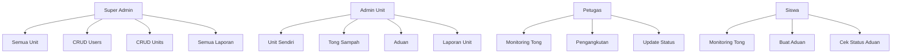

<p align="center">
  
  
  
  
  
  
  
  
  
</p>

<div align="center">
  <h1>🗑️ SiPeSa</h1>
  <p><strong>Sistem Informasi Pengelolaan Sampah</strong></p>
  <p>Platform monitoring dan pengelolaan sampah terintegrasi untuk lingkungan pendidikan</p>

  <br>

  <a href="#-fitur">Fitur</a> •
  <a href="#-tech-stack">Tech Stack</a> •
  <a href="#-struktur-folder">Struktur</a> •
  <a href="#-instalasi">Instalasi</a> •
  <a href="#-demo">Demo</a> •
  <a href="#-roadmap">Roadmap</a> •
  <a href="#-kontribusi">Kontribusi</a>
</div>

<br>

---

## 📋 Daftar Isi

- [📖 Tentang](#-tentang)
- [✨ Fitur](#-fitur)
- [🛠️ Tech Stack](#️-tech-stack)
- [👥 Role Pengguna](#-role-pengguna)
- [📂 Struktur Folder](#-struktur-folder)
- [🚀 Instalasi](#-instalasi)
- [🔧 Cara Clone & Setup](#-cara-clone--setup)
- [👀 Contoh Akun Demo](#-contoh-akun-demo)
- [🖼️ Screenshot](#️-screenshot)
- [🗺️ Roadmap Pengembangan](#️-roadmap-pengembangan)
- [🤝 Kontribusi](#-kontribusi)
- [📄 Lisensi](#-lisensi)
- [🙏 Credits](#-credits)

---

## 📖 Tentang

**SiPeSa** (Sistem Informasi Pengelolaan Sampah) adalah aplikasi web open source berbasis Laravel yang dirancang untuk memonitoring dan mengelola sampah di **Kampus B**. Aplikasi ini menghubungkan 4 peran pengguna — Super Admin, Admin Unit, Petugas Lapangan, dan Siswa — dalam satu platform yang transparan, mudah digunakan, dan responsif di HP maupun desktop.

### Masalah yang Dipecahkan

| Masalah | Solusi SiPeSa |
|---------|---------------|
| Sulit memantau status tong sampah | Monitoring realtime dengan indikator warna |
| Pengangkutan sampah tidak terdokumentasi | Riwayat pengangkutan dengan foto & catatan |
| Aduan tong penuh tidak tersampaikan | Sistem aduan siswa dengan tracking status |
| Laporan pengelolaan sampah manual | Laporan otomatis harian/mingguan/bulanan |
| Data tersebar | Semua data tersentralisasi per unit |

---

## ✨ Fitur

### 🔐 Multi Role Access
| Role | Akses |
|------|-------|
| **Super Admin** | Akses penuh ke seluruh sistem & semua unit |
| **Admin Unit** | Kelola tong & monitoring unit sendiri |
| **Petugas** | Catat pengangkutan, update status tong |
| **Siswa** | Monitoring tong, kirim aduan + foto |

### 🗑️ Monitoring Tong Sampah
- Status realtime dengan **indikator warna**:
  - 🟢 **Hijau** — Kosong
  - 🟡 **Kuning** — Setengah Penuh
  - 🔴 **Merah** — Penuh
  - 🔵 **Biru** — Sudah Diangkut
- Data per unit (SD, SMP, SMA, TK, BTM, Sumart, UMCI)
- Filter & search cepat

### 📊 Dashboard Interaktif
- Statistik lengkap dengan **Chart.js**
- Tong penuh, pengangkutan, aduan dalam satu tampilan
- Grafik tren pengangkutan 30 hari
- Perbandingan data per unit

### 📝 Aduan Siswa
- Kirim aduan dengan upload foto
- Pilih tong sampah yang bermasalah
- Tracking status aduan (Menunggu → Diproses → Selesai)

### 🚛 Pengangkutan Sampah
- Petugas mencatat pengangkutan
- Riwayat lengkap dengan foto dokumentasi
- Update status tong otomatis

### 📑 Laporan & Export
- Laporan harian, mingguan, bulanan
- Filter per unit, per petugas
- Export **PDF** & **Excel**
- Ringkasan statistik otomatis

### 📱 Responsive Mobile
- **Mobile-first design**
- **Bottom navigation** untuk HP
- Sidebar collapse untuk mobile
- Card view otomatis di layar kecil

---

## 🛠️ Tech Stack

### Backend

| Teknologi | Keterangan |
|-----------|------------|
| **Laravel 12** | PHP Framework utama |
| **PHP 8.2+** | Bahasa pemrograman |
| **MySQL** | Database management |
| **Laravel Sanctum** | Authentication SPA |
| **Laravel DomPDF** | Export PDF |
| **Laravel Excel** | Export Excel |

### Frontend

| Teknologi | Keterangan |
|-----------|------------|
| **React 18** | UI Library |
| **Inertia.js 2** | Server-driven SPA |
| **Tailwind CSS 3** | Utility CSS framework |
| **Chart.js** | Grafik & visualisasi data |
| **SweetAlert2** | Notifikasi modern |
| **Headless UI** | Aksesibel UI components |

### Tooling

| Teknologi | Keterangan |
|-----------|------------|
| **Vite 7** | Build tool & HMR |
| **Ziggy** | Route helper JavaScript |
| **Composer** | PHP dependency management |
| **npm** | JavaScript dependency management |

---

## 👥 Role Pengguna



---

## 📂 Struktur Folder

```
sipesa/
├── app/
│   ├── Http/
│   │   ├── Controllers/        # Controller aplikasi
│   │   │   ├── Auth/           # Autentikasi (login, register, dll)
│   │   │   ├── DashboardController.php
│   │   │   ├── UnitController.php
│   │   │   ├── TrashBinController.php
│   │   │   ├── TrashHistoryController.php
│   │   │   ├── ComplaintController.php
│   │   │   ├── ReportController.php
│   │   │   ├── UserController.php
│   │   │   └── ProfileController.php
│   │   └── Middleware/          # Middleware multi-role
│   │       ├── EnsureUserHasRole.php
│   │       ├── EnsureUserIsSuperAdmin.php
│   │       ├── EnsureUserIsAdminOrSuperAdmin.php
│   │       ├── EnsureUserIsPetugas.php
│   │       └── HandleInertiaRequests.php
│   └── Models/                 # Eloquent Models
│       ├── User.php
│       ├── Role.php
│       ├── Unit.php
│       ├── TrashBin.php
│       ├── TrashHistory.php
│       ├── Complaint.php
│       ├── Report.php
│       └── Activity.php
├── bootstrap/
│   └── app.php                 # Middleware registration
├── config/                     # Laravel configuration
├── database/
│   ├── migrations/             # Skema database
│   ├── seeders/                # Data awal
│   └── database.sqlite         # SQLite (opsional)
├── resources/
│   ├── js/                     # Frontend React
│   │   ├── Components/         # Shared components
│   │   ├── Layouts/            # App layouts
│   │   └── Pages/              # Halaman aplikasi
│   │       ├── Dashboard/      # Dashboard per role
│   │       ├── Auth/           # Halaman login/register
│   │       ├── Profile/        # Manajemen profil
│   │       ├── Units/          # CRUD unit
│   │       ├── TrashBins/      # CRUD + monitoring tong
│   │       ├── TrashHistories/ # Riwayat pengangkutan
│   │       ├── Complaints/     # Aduan siswa
│   │       ├── Reports/        # Laporan
│   │       └── Users/          # Manajemen user
│   └── css/                    # Tailwind CSS
├── routes/
│   ├── web.php                 # Route utama
│   └── auth.php                # Route autentikasi
├── public/                     # Public assets
├── storage/                    # Storage (logs, cache, uploads)
├── vendor/                     # Composer packages
└── node_modules/               # npm packages
```

---

## 🚀 Instalasi

### Persyaratan Sistem

| Software | Versi Min |
|----------|-----------|
| **PHP** | 8.2+ |
| **Composer** | 2.x |
| **Node.js** | 18.x+ |
| **npm** | 9.x+ |
| **MySQL** | 8.0+ |
| **Web Server** | Apache / Nginx |

### 🔧 Cara Clone & Setup

**1. Clone repository**

```bash
git clone https://github.com/username/sipesa.git
cd sipesa
```

**2. Install PHP dependencies**

```bash
composer install
```

**3. Install JavaScript dependencies**

```bash
npm install
```

**4. Copy environment file**

```bash
cp .env.example .env
```

**5. Generate application key**

```bash
php artisan key:generate
```

**6. Konfigurasi .env**

Edit file `.env` dan sesuaikan konfigurasi database:

```env
DB_CONNECTION=mysql
DB_HOST=127.0.0.1
DB_PORT=3306
DB_DATABASE=sipesa
DB_USERNAME=root
DB_PASSWORD=
```

**7. Buat database**

```sql
CREATE DATABASE sipesa CHARACTER SET utf8mb4 COLLATE utf8mb4_unicode_ci;
```

**8. Jalankan migrasi & seeder**

```bash
php artisan migrate
php artisan db:seed
```

**9. Buat storage link**

```bash
php artisan storage:link
```

**10. Build frontend**

```bash
npm run build
```

**11. Jalankan server**

```bash
php artisan serve
```

**12. Jalankan Vite (development)**

```bash
npm run dev
```

Akses aplikasi di **http://localhost:8000** 🎉

### ⚡ Quick Setup (Semua Sekali)

```bash
git clone https://github.com/username/sipesa.git
cd sipesa
composer install
npm install
cp .env.example .env
php artisan key:generate
# Edit .env untuk database
php artisan migrate --seed
php artisan storage:link
npm run build
php artisan serve
```

---

## 👀 Contoh Akun Demo

| Role | Email | Password |
|------|-------|----------|
| 🛡️ **Super Admin** | superadmin@sipesa.test | `password` |
| 🏫 **Admin SD** | adminsd@sipesa.test | `password` |
| 🚛 **Petugas** | petugas@sipesa.test | `password` |
| 🧑‍🎓 **Siswa** | siswa@sipesa.test | `password` |

> **Catatan:** Semua akun demo sudah terverifikasi email dan siap digunakan.

---

## 🖼️ Screenshot

| Halaman | Preview |
|---------|---------|
| **Landing Page** |  |
| **Dashboard Super Admin** |  |
| **Monitoring Tong** |  |
| **Aduan Siswa** |  |
| **Laporan** |  |

> 📸 **Coming soon:** Screenshot asli akan ditambahkan setelah rilis.

---

## 🗺️ Roadmap Pengembangan

### ✅ Versi 1.0 (Saat Ini)
- [x] Sistem autentikasi multi-role
- [x] CRUD unit, tong sampah, user
- [x] Monitoring tong dengan status warna
- [x] Dashboard per role dengan Chart.js
- [x] Aduan siswa dengan upload foto
- [x] Riwayat pengangkutan
- [x] Laporan harian/mingguan/bulanan
- [x] Export PDF & Excel
- [x] Responsive mobile-first design

### 🚧 Versi 1.1 (Next)
- [ ] Notifikasi realtime (WebSocket/Pusher)
- [ ] Map lokasi tong sampah (Leaflet.js)
- [ ] Jadwal pengangkutan otomatis
- [ ] Grafik lebih detail & interaktif
- [ ] Dark mode
- [ ] Fitur ekspor data massal
- [ ] API untuk integrasi pihak ketiga

### 🔮 Versi 2.0 (Future)
- [ ] Mobile app (React Native)
- [ ] Machine learning prediksi penuh tong
- [ ] IoT integration (sensor tong pintar)
- [ ] Multi-kampus support
- [ ] Dashboard realtime multi-bahasa

---

## 🤝 Kontribusi

Kami sangat terbuka terhadap kontribusi! Silakan lihat panduan kontribusi di [CONTRIBUTING.md](CONTRIBUTING.md).

### Cara Berkontribusi

1. Fork repository ini
2. Buat branch fitur (`git checkout -b feature/AmazingFeature`)
3. Commit perubahan (`git commit -m 'feat: add AmazingFeature'`)
4. Push ke branch (`git push origin feature/AmazingFeature`)
5. Buka Pull Request

### Kode Etik

Harap baca [CODE_OF_CONDUCT.md](CODE_OF_CONDUCT.md) untuk detail mengenai kode etik dan standar partisipasi.

### Keamanan

Jika Anda menemukan kerentanan keamanan, harap baca [SECURITY.md](SECURITY.md) untuk panduan pelaporan.

---

## 📄 Lisensi

Distribusi di bawah lisensi **MIT**. Lihat [LICENSE](LICENSE) untuk informasi lebih lanjut.

---

## 🙏 Credits

**SiPeSa** dikembangkan sebagai proyek Sistem Informasi Pengelolaan Sampah untuk **Kampus B**.

### Pengembang

| Peran | Nama |
|-------|------|
| **Full Stack Developer** | — |
| **UI/UX Designer** | — |
| **Project Manager** | — |

### Framework & Library

- [Laravel](https://laravel.com/) — PHP Framework
- [Tailwind CSS](https://tailwindcss.com/) — CSS Framework
- [Inertia.js](https://inertiajs.com/) — SPA Adapter
- [Chart.js](https://www.chartjs.org/) — Chart Library
- [SweetAlert2](https://sweetalert2.github.io/) — Alert Library
- [DomPDF](https://github.com/barryvdh/laravel-dompdf) — PDF Export
- [Laravel Excel](https://laravel-excel.com/) — Excel Export

### Dukungan

<p align="center">
  <a href="https://laravel.com">
    
  </a>
</p>

---

<p align="center">
  <strong>SiPeSa</strong> — <em>Sistem Informasi Pengelolaan Sampah</em>
  <br>
  Dibuat dengan ❤️ untuk lingkungan yang lebih bersih
</p>
